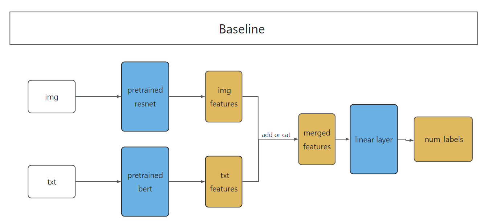

# MultiModal-SentimentAnalysis

## Project Structure

```shell
├─ data        # Data directory containing text and image data
├─ dataset     # Module constructing Dataset class for iteration
├─ models      # Main models directory
│  ├─ attentionModel
│  ├─ baseline
│  ├─ flava
├─ output      # Output directory containing predicted files and relevant figures
├─ papers      # Directory for storing relevant papers
├─ preprocess  # Data preprocessing module
├─ test        # Directory for testing
├─ .gitignore
├─ constant.py 
├─ flava.ipynb        # FLAVA model related file
├─ LICENSE
├─ main.py            # Core file
├─ predict.sh         # Prediction script
├─ README.md 
├─ requirements.txt 
├─ test_without_label.txt
├─ train.sh           # Training script
├─ train.txt
├─ utils.py           # Store Trainer and other utility functions
└─ __init__.py
```


## Models

### Baseline



### Attention Model


### FLAVA


## Results

- Baseline
  - Cat: 65.00%
    - only_img: 65.75%
    - only_txt: 58.00%
    
  - Add: 65.00%
    
  
- EncoderLayer: 63.38%
  
    

## How to Run

1. For training, simply run:

```shell
bash train.sh
```

You can choose the model type and adjust other hyperparameters as needed.

2. For prediction, run:

```shell
bash predict.sh
```

This script will generate the predictions and output files to the `output/test.txt`


## Star History

[](https://star-history.com/#Muqi1029/MultiModal-SentimentAnalysis&Timeline)
